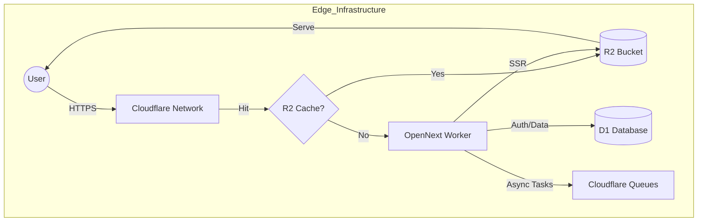

**Nebula-SaaS** is a "Principal Architect" grade starter kit designed for extreme scale on the Cloudflare Edge. It abandons traditional VPS bottlenecks in favor of a purely serverless, globally distributed architecture.

> **Performance Target:** 10,000+ Concurrent Users  
> **Cold Start:** < 10ms (Zero-ORM implementation)  
> **Cost Model:** Scale-to-Zero (Pay only for invocations)

---

## 🏗 Architecture

This system runs entirely on **Cloudflare Workers** using **OpenNext**. State is managed via **D1 (SQLite)** with a raw SQL access layer for maximum throughput, and HTML pages are cached at the edge using **R2**.



## ⚡ Tech Stack

* **Framework:** Next.js 15 (via OpenNext)
* **Runtime:** Cloudflare Workers (Edge)
* **Database:** Cloudflare D1 (SQLite) - *Accessed via Raw SQL (No ORM)*
* **Caching:** Cloudflare R2 (Incremental Static Regeneration backing)
* **Auth:** Better-Auth (Edge-native, D1-backed)
* **Styling:** Tailwind CSS + Shadcn/UI
* **Validation:** Zod

---

## 🚀 "No Ops" Deployment (GitHub Actions)

This project is designed for **Zero Local Ops**. You do not deploy from your laptop. You push code, and the infrastructure self-assembles.

### 1. Prerequisites

You need a Cloudflare Account.

1. **Create D1 Database:** `nebula-db`
2. **Create R2 Bucket:** `nebula-cache`
3. **Get Account ID:** Found in Cloudflare Dashboard URL or Sidebar.

### 2. GitHub Secrets

Go to your Repository -> **Settings** -> **Secrets and variables** -> **Actions** and add:

| Secret Name | Value |
| --- | --- |
| `CLOUDFLARE_API_TOKEN` | Create via "Edit Cloudflare Workers" template |
| `CLOUDFLARE_ACCOUNT_ID` | Your Cloudflare Account ID |

### 3. Deploy

Simply push to `main`.

* The workflow automatically builds the Next.js app.
* It applies any changes in `schema.sql` to your D1 database.
* It deploys the Worker to the edge network.

---

## 🛠 Development

While deployment is automated, you can run the stack locally using the Cloudflare proxy.

```bash
# 1. Install Dependencies
npm install

# 2. Setup Local Environment
# Ensure you are logged in to wrangler
npx wrangler login

# 3. Run Dev Server
npm run dev

```

---

## 💾 Database & Migrations

**Architect's Note:** We removed Drizzle/Prisma to eliminate the 5MB+ bundle overhead and 500ms cold start penalty. We use **Raw SQL** with parameter binding for security.

### Modifying the Schema

Edit `schema.sql`. This file is the "Source of Truth".

### Applying Changes

To apply changes to the **Production** database (use with caution):

```bash
npm run db:migrate

```

*This sends the `schema.sql` file to the D1 API, executing only new statements.*

---

## 📂 Project Structure

```bash
├── .github/workflows/   # CI/CD Pipelines
├── .open-next/          # Build artifacts (auto-generated)
├── src/
│   ├── app/             # Next.js App Router
│   ├── lib/
│   │   ├── db.ts        # Raw SQL Wrapper (D1 binding)
│   │   ├── auth.ts      # Better-Auth Config
│   │   └── auth-repo.ts # Data Access Layer (Repository Pattern)
│   └── db/
│       └── schema.sql   # Database Definition
├── open-next.config.ts  # Edge Cache Configuration
├── wrangler.jsonc       # Infrastructure as Code
└── package.json         # Automation Scripts

```

## ⚖️ Trade-offs

| Decision | Pro | Con |
| --- | --- | --- |
| **Raw SQL vs ORM** | Instant startup, tiny bundle size. | No type-safety on query *results* (manual interface mapping required). |
| **D1 vs Postgres** | Zero latency (same datacenter), cheap. | Limited to 10GB (currently), eventual consistency in some modes. |
| **OpenNext vs Vercel** | No vendor lock-in, runs on CF. | Setup is more complex (handled by this template). |

---

## 📜 License

MIT
